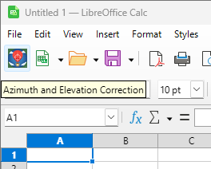
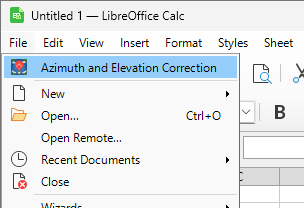

# TIPIS Extension for LibreOffice

**TIPIS** (_TEBAL Input Processing Improvement Suite_) is a LibreOffice extension designed to automate validation, normalization, and formatting of TEBAL exported CSV files. This extension processes data such as height, azimuth, elevation, and offers color-coded validation results and status information.

> **Note:** TEBAL is proprietary software and requires a valid license for usage. **TEBAL is developed and owned by BREITHAUPT Kassel.** This extension is an independent tool designed to process CSV output generated by TEBAL and is not affiliated with or endorsed by BREITHAUPT Kassel.

---

## Features

- **Automated Data Validation**:
  - Verifies file naming conventions, time sequences, and numeric integrity of TEBAL-exported CSV data rows.
  - Flags and describes anomalies, including abnormal climb rates, azimuth spikes, and constant elevation errors.

- **Azimuth & Elevation Normalization**:
  - Ensures measurement values (azimuth, elevation) are constrained within expected ranges.
  - Automatically adjusts azimuth values exceeding 90° for easier pilot balloon observation and follow-up analysis.

- **Output Table with Status Visualization**:
  - Adds a formatted output table with validation results.
  - Color-codes rows based on validation status for easy interpretation.

- **Ez-Access Workflow**:
  - Accessible via a custom toolbar icon ("Azimuth and Elevation Correction") on the *Standard* toolbar.
  - Can also be triggered via the `File` menu under the `Azimuth and Elevation Correction` submenu, which appears before the "New" menu entry.

---

## Purpose of Azimuth and Elevation Correction

The azimuth and elevation values exported by the TEBAL software are already accurate and comply with standard data requirements for balloon observations. However, to simplify manual observation of pilot balloon data, **this extension provides an optional correction function**.

When the azimuth values appear greater than 90°, the extension recalculates and adjusts the azimuth and elevation data for better consistency and readability during observational analysis. This is the **key functionality** of TIPIS and is designed to enhance accessibility for meteorological observers managing TEBAL data.

---

## System Requirements

- **LibreOffice**: 25.8.4.2
- **Operating System**: Microsoft Windows
- **TIPIS.oxt**: The LibreOffice Extension Package

---

## Getting Started

### Installation

1. Clone or download this repository:
   ```bash
   git clone https://github.com/yourusername/TIPIS.git
   ```
   Alternatively, click the green **Code** button at the top of the repository page, and select **Download ZIP**.

2. Extract the repository ZIP (if applicable) and locate the file `TIPIS.oxt`.

3. Open LibreOffice and navigate to `Tools > Extension Manager...`.

4. Click `Add`, select the `TIPIS.oxt` file, and follow the installation prompts.

5. Restart LibreOffice to activate the extension.

---

### Usage

There are **two ways** to run the TIPIS utility after installation:

1. **Via Toolbar**:
   - Locate and click the `"Azimuth and Elevation Correction"` icon in the *Standard* toolbar. This icon is positioned just before the "New" button.



2. **Via File Menu**:
   - Open the `File` menu and click the `"Azimuth and Elevation Correction"` submenu entry, located just before the "New" submenu.



The macro will execute the following steps:

1. Validate the file name format (must follow `YYYYMMDD_HH.csv`, e.g., `20260113_12.csv`).
2. Check required column headers and unit consistency.
3. Process all rows to:
   - Normalize values, check for spikes, and validate measurements.
   - Adjust azimuth values greater than 90° for better visibility, if applicable.
   - Flag and describe anomalies in the output table.

---

### Input Requirements

- **Naming Convention**: Files must be named in the `YYYYMMDD_HH.csv` format (e.g., `20260113_12.csv`).
- **Headers**: The input CSV must follow TEBAL’s export format, including expected labels for relevant columns.

---

## Development

### Customizing Constants

To adjust processing thresholds (e.g., climb rates, azimuth/elevation limits), modify the constants in the macro code:

```basic
Const CLIMB_RATE_START_HEIGHT = 300.0
Const LIMIT_CLIMB_MIN = 450.0
Const LIMIT_CLIMB_MAX = 550.0
Const LIMIT_AZIM_HIGH = 90.0
Const MAX_ROW_LIMIT = 32500
```

### Contributing

Contributions are welcome! Fork this repository, make improvements, and submit a pull request. You can also open issues for bug reports or feature requests.

---

## Legal Disclaimer

This extension facilitates post-processing of exported data from **TEBAL**, proprietary software developed and owned by **BREITHAUPT Kassel**. You must have a valid TEBAL software license to use its export features. This project is independently developed and is not affiliated with or endorsed by BREITHAUPT Kassel.

Usage of this extension is at the user's own risk, and compliance with applicable proprietary software license agreements remains the user's responsibility.

---

## License

This project is licensed under the Apache License 2.0.

---

## Acknowledgements

- Created by **Sidik Hadi Kurniadi**, inspired by the need to simplify and automate validation of exported TEBAL data.
- **Development Support**:
  - This extension was coded with the help of **Microsoft Copilot**, bringing efficiency and precision to the coding process.
  - Icon assets for the extension were designed using **Google Gemini**.
- Special recognition to **BREITHAUPT Kassel** for developing the TEBAL software.
- Appreciation to Linus Torvalds as a role model in vibe coding.

---

Feel free to reach out via GitHub issues for assistance or feedback. Thank you for using TIPIS!
